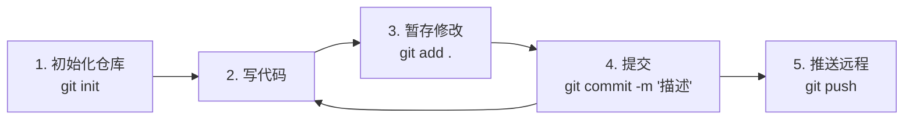

# 🚀 Antigravity 中使用 Git 的零基础指南

## 一、Git 是什么？

Git 是一个**版本控制系统**，你可以把它想象成游戏里的「存档系统」：

| 概念 | 类比 | 说明 |
|------|------|------|
| **Repository (仓库)** | 游戏存档文件夹 | 存放你所有代码和历史记录的地方 |
| **Commit (提交)** | 一次存档 | 记录某一时刻代码的快照 |
| **Branch (分支)** | 平行存档槽 | 可以在不影响主线的情况下尝试新功能 |
| **Stage (暂存区)** | 存档前的确认清单 | 选择哪些修改要纳入下一次存档 |
| **Push / Pull** | 上传/下载存档 | 与远程服务器同步你的代码 |

---

## 二、前置准备

### 2.1 确认 Git 已安装

你可以直接让我帮你运行命令来检查：

> **你说**: "帮我检查 git 是否已安装"
> **我会运行**: `git --version`

如果未安装，前往 [git-scm.com](https://git-scm.com/download/win) 下载安装。

### 2.2 首次配置 Git 身份

> [!IMPORTANT]
> Git 要求每次提交都要有作者信息。首次使用必须配置：

```bash
git config --global user.name "你的名字"
git config --global user.email "你的邮箱@example.com"
```

你可以直接告诉我你的名字和邮箱，我帮你执行。

---

## 三、在 Antigravity 中使用 Git 的方式

### 方式一：直接让我执行 Git 命令 ✅ 推荐

你可以用自然语言告诉我你想做什么，我会翻译成 Git 命令并执行。例如：

| 你说的话 | 我执行的命令 |
|---------|------------|
| "帮我初始化一个 git 仓库" | `git init` |
| "看看现在有哪些文件改了" | `git status` |
| "把所有修改都提交一下，备注写'修复登录bug'" | `git add .` → `git commit -m "修复登录bug"` |
| "看看提交历史" | `git log --oneline -10` |
| "创建一个新分支叫 feature-login" | `git checkout -b feature-login` |
| "把代码推到 GitHub" | `git push origin main` |
| "撤销上一次提交" | `git reset --soft HEAD~1` |

> [!TIP]
> 你完全不需要记住命令！只需用中文描述你的意图，我来处理。

### 方式二：在 VS Code 侧边栏使用 Source Control 面板

如果你更喜欢图形界面：

1. 点击左侧边栏的 **Source Control 图标**（看起来像分支的 Y 形图标）
2. 在「Changes」下看到所有修改过的文件
3. 点击文件旁的 **`+`** 号将其暂存（Stage）
4. 在顶部输入框写提交信息
5. 点击 **✓ (Commit)** 按钮提交

---

## 四、Git 核心工作流（配合 Antigravity）

### 4.1 从零开始的项目



**实际对话示例：**

> **你**: 帮我在当前项目初始化 git 仓库  
> **我**: 执行 `git init`，创建 `.gitignore` 文件  
>  
> **你**: 现在把所有文件提交一下  
> **我**: 执行 `git add .` + `git commit -m "Initial commit"`  
>  
> **你**: 连接到我的 GitHub 仓库 https://github.com/xxx/yyy.git  
> **我**: 执行 `git remote add origin <URL>` + `git push -u origin main`

### 4.2 克隆已有项目

> **你**: 帮我克隆这个项目 https://github.com/user/repo.git  
> **我**: 执行 `git clone https://github.com/user/repo.git`

### 4.3 日常开发流程

```
写代码 → 查看改动 → 暂存 → 提交 → 推送
```

每个步骤你都可以让我帮你操作：

```
你: "看看我改了什么"          → git status / git diff
你: "把 app.py 的修改暂存"    → git add app.py
你: "提交，备注'添加用户认证'" → git commit -m "添加用户认证"
你: "推到远程"                → git push
```

---

## 五、常用场景速查

### 📌 场景 1：查看当前状态

> **你说**: "看看 git 状态"

我会运行 `git status`，告诉你：
- 哪些文件被修改了
- 哪些文件是新增的
- 哪些已暂存等待提交

### 📌 场景 2：查看具体改了什么

> **你说**: "看看 app.py 改了哪些内容"

我会运行 `git diff app.py`，显示具体的代码差异。

### 📌 场景 3：撤销修改

| 你想做的 | 命令 |
|---------|------|
| 撤销某文件的未暂存修改 | `git checkout -- 文件名` |
| 取消暂存（但保留修改） | `git reset HEAD 文件名` |
| 撤销最近一次提交（保留代码） | `git reset --soft HEAD~1` |
| 彻底回退到某个版本 | `git reset --hard <commit-id>` |

> [!CAUTION]
> `git reset --hard` 会**永久丢失**未提交的修改！使用前请确认。

### 📌 场景 4：分支管理

```
你: "创建一个新分支叫 dev"          → git checkout -b dev
你: "切换到 main 分支"              → git checkout main
你: "把 dev 分支合并到 main"         → git merge dev
你: "看看有哪些分支"                 → git branch -a
你: "删除 dev 分支"                  → git branch -d dev
```

### 📌 场景 5：与远程仓库交互

```
你: "拉取最新代码"                   → git pull
你: "推送代码到远程"                 → git push
你: "看看远程仓库地址"               → git remote -v
```

### 📌 场景 6：查看历史

```
你: "看看最近10条提交记录"           → git log --oneline -10
你: "看看某个文件的修改历史"          → git log --follow 文件名
你: "谁写了这行代码"                 → git blame 文件名
```

---

## 六、.gitignore 文件

> [!NOTE]
> `.gitignore` 告诉 Git 哪些文件不需要追踪（比如密码、缓存、依赖包等）。

常见的 Python 项目 `.gitignore` 内容：

```gitignore
# Python
__pycache__/
*.py[cod]
*.egg-info/
dist/
build/
.eggs/

# 虚拟环境
venv/
.env

# IDE
.vscode/
.idea/

# 系统文件
.DS_Store
Thumbs.db

# 敏感信息
*.key
*.pem
.env.local
```

> **你说**: "帮我创建一个 Python 项目的 .gitignore"  
> **我**: 自动生成并创建文件 ✅

---

## 七、连接 GitHub / GitLab 远程仓库

### 步骤一：在 GitHub 创建空仓库

1. 访问 [github.com](https://github.com) → 点击「New repository」
2. 输入仓库名，**不要**勾选 README（避免冲突）
3. 复制仓库 URL

### 步骤二：让我帮你连接

> **你说**: "把这个项目连接到 GitHub，地址是 https://github.com/myname/myrepo.git"

我会执行：
```bash
git remote add origin https://github.com/myname/myrepo.git
git branch -M main
git push -u origin main
```

### 关于认证

> [!IMPORTANT]
> GitHub 已不支持密码认证。你需要使用以下方式之一：
> 
> 1. **Personal Access Token (PAT)**：在 GitHub Settings → Developer Settings → Personal Access Tokens 生成
> 2. **SSH Key**：更安全，一次配置永久使用
> 
> 告诉我你想用哪种方式，我可以一步步指导你配置。

---

## 八、Git 工作流最佳实践

### ✅ 提交信息规范

好的提交信息让你和团队都受益：

| 类型 | 格式 | 示例 |
|------|------|------|
| 新功能 | `feat: 描述` | `feat: 添加用户注册功能` |
| 修复 | `fix: 描述` | `fix: 修复登录页面崩溃` |
| 文档 | `docs: 描述` | `docs: 更新 README 安装说明` |
| 重构 | `refactor: 描述` | `refactor: 优化数据库查询逻辑` |
| 样式 | `style: 描述` | `style: 调整按钮颜色和间距` |

### ✅ 常见好习惯

1. **频繁提交**：每完成一个小功能就提交，不要攒一大堆
2. **写清楚提交信息**：未来的你会感谢现在的你
3. **提交前检查**：运行 `git diff` 确认改动内容
4. **不提交敏感信息**：密码、密钥等放在 `.env` 并加入 `.gitignore`
5. **善用分支**：大功能在新分支开发，完成后合并

---

## 九、常见问题 FAQ

### Q: 我不小心提交了不该提交的文件怎么办？

> **你说**: "我不小心把 .env 文件提交了，帮我从 git 中删除但保留本地文件"

我会执行：
```bash
git rm --cached .env
echo ".env" >> .gitignore
git commit -m "从版本控制中移除 .env"
```

### Q: 合并冲突怎么办？

当两个分支修改了同一处代码时会发生冲突。你可以：

> **你说**: "帮我看看哪些文件有冲突" → `git status`  
> **你说**: "帮我解决 app.py 的冲突" → 我会打开文件，分析冲突并帮你合并

### Q: 怎么回到之前的版本？

> **你说**: "帮我看看提交历史，我想回到之前的某个版本"

我会展示历史记录，你选择要回到的版本，我帮你执行。

### Q: push 被拒绝了怎么办？

通常是因为远程有更新的提交。解决方法：

```bash
git pull --rebase origin main   # 先拉取并变基
git push origin main            # 再推送
```

---

## 十、快速参考卡片

```
┌─────────────────────────────────────────────────┐
│              Git 命令速查                        │
├─────────────────────────────────────────────────┤
│ 初始化    git init                               │
│ 克隆      git clone <URL>                        │
│ 状态      git status                             │
│ 差异      git diff                               │
│ 暂存      git add <文件>  |  git add .           │
│ 提交      git commit -m "描述"                    │
│ 历史      git log --oneline                      │
│ 分支      git branch / git checkout -b <名称>     │
│ 合并      git merge <分支名>                      │
│ 推送      git push                               │
│ 拉取      git pull                               │
│ 撤销      git reset / git checkout -- <文件>      │
└─────────────────────────────────────────────────┘
```

> [!TIP]
> **记住：在 Antigravity 中，你不需要记住任何命令。** 
> 只需用自然语言告诉我你想做什么，我会帮你翻译成正确的 Git 操作并执行。
> 比如："帮我把今天的改动都提交了，备注写今天的日期。"
