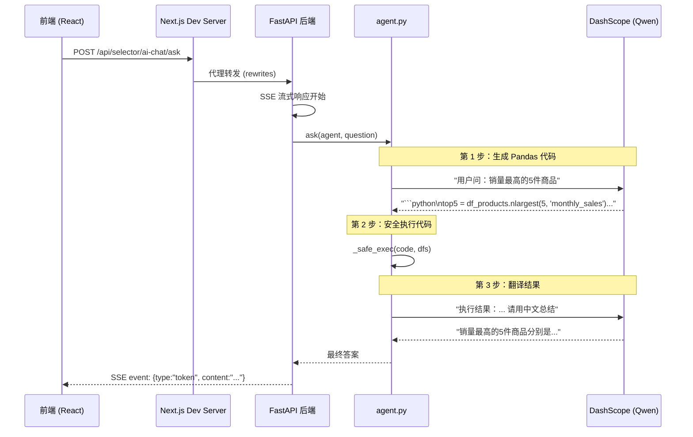

# 🎓 Sniffy 选品系统开发 — 完整技术总结

> 本文档总结了我们在本次会话中对 Sniffy App 选品系统模块所做的全部开发工作。  
> 每个功能点都包含 **架构说明、修改了哪些文件、关键代码解析** 和 **学到的知识点**。

---

## 📋 总览：完成了 5 个核心功能

| # | 功能 | 涉及技术栈 |
|---|---|---|
| 1 | HTML 报告嵌入 | FastAPI 静态文件 + iframe |
| 2 | 品类选择 & 侧栏子菜单 | Next.js 动态路由 + React 组件 |
| 3 | AI 聊天面板 UI | React State + CSS 动画 |
| 4 | AI 后端接入 (DashScope/Qwen) | FastAPI SSE + Text-to-Pandas |
| 5 | 环境变量统一管理 | .env + 后端 API 驱动前端 |

---

## 功能 1️⃣：HTML 报告嵌入

### 需求
点击「选品系统」时，展示 `汽车配件.html` 这个本地 HTML 报告。

### 架构
```
浏览器 (iframe)
    ↓ GET /dashboards/product_selector_data/汽车配件.html
Next.js dev server (rewrites 代理)
    ↓ 转发到后端
FastAPI (StaticFiles 挂载)
    ↓ 从本地目录读取文件
src/features/product_selector/data/汽车配件.html
```

### 修改的文件

#### [app.py](file:///d:/snf/git/sniffy_app/app.py) — 后端静态文件挂载

```python
# 关键代码：用 FastAPI 的 StaticFiles 把本地目录挂载为 HTTP 可访问的路径
from starlette.staticfiles import StaticFiles

app.mount(
    "/dashboards/product_selector_data",        # URL 路径
    StaticFiles(directory=str(ps_data), html=True),  # 本地目录
    name="product_selector_data",
)
```

> [!NOTE]
> **知识点：StaticFiles**  
> FastAPI/Starlette 的 `StaticFiles` 可以把任意本地目录映射为 HTTP 静态资源服务。  
> `html=True` 表示支持自动解析 `.html` 文件。这和 Nginx 的 `root` 指令作用类似。

#### [next.config.ts](file:///d:/snf/git/sniffy_app/frontend/next.config.ts) — 已有的代理配置

```typescript
// Next.js 开发模式下，把 /dashboards/* 请求代理到后端
async rewrites() {
    return [
        { source: "/dashboards/:path*", destination: `${BACKEND}/dashboards/:path*` },
    ];
}
```

> [!TIP]
> **知识点：Next.js Rewrites**  
> 在开发模式下，Next.js 运行在 `localhost:3000`，后端在 `localhost:7860`。  
> Rewrites 让浏览器以为所有请求都发到同一个域名，避免跨域问题。  
> 生产环境中由 Caddy 反向代理完成同样的事情。

#### [[category]/page.tsx](file:///d:/snf/git/sniffy_app/frontend/src/app/%28app%29/product-selector/%5Bcategory%5D/page.tsx) — 前端 iframe 嵌入

```tsx
<iframe
    src={config.report_url}  // "/dashboards/product_selector_data/汽车配件.html"
    title={`${config.name}选品报告`}
    className="w-full h-full border-0"
    sandbox="allow-scripts allow-same-origin allow-popups"
/>
```

> [!NOTE]
> **知识点：iframe sandbox**  
> `sandbox` 属性限制 iframe 内的行为，防止恶意代码。  
> - `allow-scripts` — 允许运行 JS  
> - `allow-same-origin` — 允许同源请求  
> - `allow-popups` — 允许弹窗

---

## 功能 2️⃣：品类选择 & 侧栏子菜单

### 需求
点击「选品系统」时，侧栏展开三个子项（汽车配件、女士内裤、瑜伽服），点击直接跳转。

### 架构
```
Sidebar
  └─ NavItem (选品系统)
       ├─ 🚗 汽车配件  → /product-selector/auto-parts
       ├─ 👙 女士内裤  → /product-selector/womens-underwear
       └─ 🧘 瑜伽服   → /product-selector/yoga-wear

Next.js 路由:
  /product-selector/           → redirect → /product-selector/auto-parts
  /product-selector/[category] → 动态路由，根据 category 渲染不同内容
```

### 修改的文件

#### [nav-item.tsx](file:///d:/snf/git/sniffy_app/frontend/src/components/shell/nav-item.tsx) — 支持子菜单

```tsx
interface NavItemProps {
    href: string;
    label: string;
    icon: ReactNode;
    matchPrefix?: string;
    children?: { href: string; label: string }[];  // 新增：子菜单项
}

export function NavItem({ href, label, icon, matchPrefix, children }: NavItemProps) {
    const pathname = usePathname();
    const isActive = pathname === href || pathname.startsWith(prefix);
    const hasChildren = children && children.length > 0;

    return (
        <div>
            {/* 父菜单项 */}
            <Link href={href} ...>{icon} {label}</Link>

            {/* 子菜单：父项激活时才显示 */}
            {hasChildren && isActive && (
                <div className="ml-[26px] border-l border-neutral-200 pl-3">
                    {children.map((child) => (
                        <Link href={child.href} ...>{child.label}</Link>
                    ))}
                </div>
            )}
        </div>
    );
}
```

> [!NOTE]
> **知识点：`usePathname()` Hook**  
> Next.js 的 `usePathname()` 返回当前页面的 URL 路径。  
> 我们用它来判断哪个菜单项是"激活"状态，从而高亮显示 + 展开子菜单。

#### [sidebar.tsx](file:///d:/snf/git/sniffy_app/frontend/src/components/shell/sidebar.tsx) — 注册子菜单

```tsx
const PRIMARY_NAV = [
    // ...其他菜单项...
    {
        href: "/product-selector/auto-parts",
        label: "选品系统",
        icon: <IconBox />,
        matchPrefix: "/product-selector",
        children: [  // 子菜单定义
            { href: "/product-selector/auto-parts", label: "🚗 汽车配件" },
            { href: "/product-selector/womens-underwear", label: "👙 女士内裤" },
            { href: "/product-selector/yoga-wear", label: "🧘 瑜伽服" },
        ],
    },
];
```

#### [page.tsx](file:///d:/snf/git/sniffy_app/frontend/src/app/%28app%29/product-selector/page.tsx) — 根路径重定向

```tsx
import { redirect } from "next/navigation";

export default function ProductSelectorPage() {
    redirect("/product-selector/auto-parts");  // 自动跳转到第一个品类
}
```

> [!TIP]
> **知识点：Next.js 动态路由 `[category]`**  
> 文件夹名 `[category]` 中的方括号表示这是一个动态路由参数。  
> 访问 `/product-selector/auto-parts` 时，`category = "auto-parts"`。  
> 访问 `/product-selector/yoga-wear` 时，`category = "yoga-wear"`。

---

## 功能 3️⃣：AI 聊天面板 UI

### 需求
在选品报告右侧添加一个可收起展开的 AI 聊天对话框。

### 组件结构
```
AiChatPanel
  ├─ 收起时：蓝色 "AI 助手" 侧标签（fixed 定位在屏幕右侧）
  └─ 展开时：380px 宽的面板
       ├─ Header（渐变蓝色，品类名称）
       ├─ Messages（消息气泡列表，自动滚到底部）
       │    ├─ AI 消息（白色气泡，左对齐）
       │    └─ User 消息（蓝色气泡，右对齐）
       └─ Input（输入框 + 发送按钮）
```

### 关键文件

#### [AiChatPanel.tsx](file:///d:/snf/git/sniffy_app/frontend/src/components/features/product-selector/AiChatPanel.tsx)

**状态管理：**
```tsx
const [isOpen, setIsOpen] = useState(false);      // 面板是否打开
const [input, setInput] = useState("");             // 输入框内容
const [isLoading, setIsLoading] = useState(false);  // 是否在等 AI 回复
const [messages, setMessages] = useState<ChatMessage[]>([...]);  // 消息列表
```

**自动滚动到底部：**
```tsx
const messagesEndRef = useRef<HTMLDivElement>(null);

useEffect(() => {
    messagesEndRef.current?.scrollIntoView({ behavior: "smooth" });
}, [messages]);  // 每次 messages 变化都滚到底
```

**Enter 键发送：**
```tsx
const handleKeyDown = (e: React.KeyboardEvent<HTMLTextAreaElement>) => {
    if (e.key === "Enter" && !e.shiftKey) {  // Enter 发送，Shift+Enter 换行
        e.preventDefault();
        handleSend();
    }
};
```

> [!NOTE]
> **知识点：React `useRef` + `useEffect` 组合**  
> - `useRef` 创建一个"引用"，指向 DOM 元素（这里是消息列表底部的空 div）  
> - `useEffect` 监听 `messages` 变化，每次变化时调用 `scrollIntoView`  
> - 这是 React 中实现"聊天自动滚到底"的标准模式

---

## 功能 4️⃣：AI 后端接入 (DashScope / Qwen)

### 需求
把现有的 `AI_for_PrivateData` 项目（Text-to-Pandas 引擎）接入到我们的 Web 界面中。

### 架构（**最重要的部分**）



### 修改的文件

#### [ai_chat_router.py](file:///d:/snf/git/sniffy_app/src/features/product_selector/ai_chat_router.py) — **核心：后端 SSE 端点**

**懒加载初始化（避免启动变慢）：**
```python
_agent: dict | None = None  # 全局缓存

def _ensure_agent() -> dict:
    global _agent
    if _agent is not None:
        return _agent  # 已初始化，直接返回
    
    # 首次调用时才加载数据 + 创建 Agent
    dfs = load_ecommerce_data(str(json_path))
    _agent = create_qa_agent(dfs)
    return _agent
```

**SSE (Server-Sent Events) 流式响应：**
```python
@router.post("/ask")
async def ai_chat_ask(body: ChatRequest) -> StreamingResponse:
    async def _event_stream():
        # 1. 告诉前端"我在思考"
        yield f"data: {json.dumps({'type': 'thinking'})}\n\n"
        
        # 2. 在线程池中运行阻塞的 AI 调用（不阻塞事件循环）
        answer = await asyncio.to_thread(ask, agent, body.question)
        
        # 3. 返回结果
        yield f"data: {json.dumps({'type': 'token', 'content': answer})}\n\n"
        yield f"data: {json.dumps({'type': 'done'})}\n\n"
    
    return StreamingResponse(_event_stream(), media_type="text/event-stream")
```

> [!IMPORTANT]
> **知识点：`asyncio.to_thread()` — 异步与同步的桥梁**  
> FastAPI 是异步的 (async)，但 `agent.ask()` 是同步阻塞的（要等 LLM 返回）。  
> `asyncio.to_thread()` 把同步函数放到线程池里跑，不会阻塞整个服务器。  
> 这是 Python 异步编程中非常重要的模式！

> [!NOTE]
> **知识点：SSE (Server-Sent Events)**  
> SSE 是 HTTP 长连接技术，服务器可以持续"推送"数据给浏览器。  
> 格式：每条消息以 `data: ` 开头，以 `\n\n` 结尾。  
> 比 WebSocket 简单，适合"服务器单向推送"场景（如 AI 聊天）。

**前端 SSE 解析：**
```tsx
const response = await fetch("/api/selector/ai-chat/ask", {
    method: "POST",
    headers: { "Content-Type": "application/json" },
    body: JSON.stringify({ question: text }),
});

const reader = response.body?.getReader();
const decoder = new TextDecoder();

while (true) {
    const { done, value } = await reader.read();
    if (done) break;
    
    const chunk = decoder.decode(value, { stream: true });
    // 解析 SSE 格式：每行 "data: {...json...}"
    for (const line of chunk.split("\n")) {
        if (!line.startsWith("data: ")) continue;
        const event = JSON.parse(line.slice(6));
        
        if (event.type === "token") fullContent += event.content;
        if (event.type === "error") fullContent = `❌ ${event.message}`;
    }
}
```

### agent.py 中的 Text-to-Pandas 流程（原有代码）

```python
def ask(agent, question):
    # Step 1: LLM 生成 Pandas 代码
    llm_text = _llm_chat([
        {"role": "system", "content": system_prompt},  # 包含 DataFrame 结构信息
        {"role": "user", "content": question},
    ])
    
    # Step 2: 提取代码 + 安全执行
    code = _extract_code(llm_text)  # 用正则提取 ```python...``` 中的代码
    exec_result = _safe_exec(code, dfs)  # 在沙箱中执行
    
    # Step 3: LLM 将执行结果翻译为自然语言
    final_answer = _llm_chat([
        {"role": "system", "content": "根据代码执行结果，用中文回答"},
        {"role": "user", "content": f"问题: {question}\n结果: {exec_result}"},
    ])
    return final_answer
```

> [!WARNING]
> **知识点：代码沙箱 `_safe_exec()`**  
> 直接执行 LLM 生成的代码有安全风险！agent.py 通过以下方式降低风险：  
> - `__builtins__: {}` — 禁用所有内置函数  
> - 只白名单暴露 `pd`, `len`, `range`, `sorted` 等安全函数  
> - 过滤掉所有 `import` 语句  
> - 使用 `.copy()` 传入数据，防止原始数据被修改

---

## 功能 5️⃣：环境变量统一管理

### 需求
把分散在各处的配置统一到项目根目录的 `.env` 文件中。

### 最终的 `.env` 结构

```bash
# --- AI 选品助手 (DashScope / Qwen) ---
DASHSCOPE_API_KEY=sk-xxx                    # 原 OPENAI_API_KEY
DASHSCOPE_BASE_URL=https://dashscope...     # 原 OPENAI_BASE_URL
DASHSCOPE_MODEL=qwen-plus-2025-07-28       # 原 LLM_MODEL
SELECTOR_AI_DATA_PATH=src/.../data.json     # 原 DATA_PATH（改为相对项目根目录）

# --- 选品报告 HTML 文件 ---
SELECTOR_REPORTS_DIR=src/.../data           # HTML 报告目录
SELECTOR_REPORT_AUTO_PARTS=汽车配件.html     # 有值 = 有报告
SELECTOR_REPORT_WOMENS_UNDERWEAR=           # 空值 = 未就绪
SELECTOR_REPORT_YOGA_WEAR=                  # 空值 = 未就绪
```

### 配置驱动的 API 端点

```python
# ai_chat_router.py — /api/selector/ai-chat/categories
@router.get("/categories")
async def get_categories():
    items = []
    for slug, name, emoji, env_key in _CATEGORIES_DEF:
        filename = os.environ.get(env_key, "").strip()
        report_url = f"/dashboards/product_selector_data/{filename}" if filename else None
        items.append(CategoryItem(slug=slug, name=name, report_url=report_url))
    return items
```

> [!TIP]
> **知识点：配置与代码分离**  
> 好的架构应该把"会变化的东西"（文件路径、API Key）放到配置文件中，  
> 而不是硬编码在代码里。这样：  
> - 添加新品类只需改 `.env`（+ 注册一行代码）  
> - 不同环境（开发/测试/生产）可以用不同的配置  
> - 敏感信息（API Key）不会提交到 Git

---

## 🎨 UI 优化（额外细节）

### 全宽布局突破

**问题**：父布局 `max-w-6xl`（1152px）限制了内容宽度，报告两侧出现白边。

**解决**：用 CSS `calc()` 计算出实际可用宽度并突破父容器：

```tsx
style={{
    width: "calc(100vw - 15rem)",  // 视口宽度 - 侧栏宽度
    marginLeft: "calc(-1 * (100vw - 15rem - 100%) / 2)",  // 居中偏移
}}
```

### 面包屑隐藏

**问题**：面包屑 `概览 > 选品系统 > auto-parts` 在全屏报告页面显得多余。

**解决**：在 Topbar 组件中根据路由条件返回 `null`：

```tsx
if (pathname.startsWith("/product-selector/")) {
    return null;  // 不渲染面包屑
}
```

---

## 📁 修改文件汇总

| 文件 | 操作 | 用途 |
|---|---|---|
| `.env` | 修改 | 统一所有环境变量 |
| `app.py` | 修改 | 静态文件挂载 + AI chat 路由挂载 |
| `ai_chat_router.py` | **新建** | AI 聊天 SSE 端点 + 品类配置 API |
| `AiChatPanel.tsx` | **新建** | AI 聊天面板 React 组件 |
| `[category]/page.tsx` | **新建** | 动态品类报告页面 |
| `page.tsx` (product-selector) | 修改 | redirect 到默认品类 |
| `nav-item.tsx` | 修改 | 支持子菜单 |
| `sidebar.tsx` | 修改 | 添加品类子菜单项 |
| `topbar.tsx` | 修改 | 选品页面隐藏面包屑 |

---

## 🧠 核心知识点回顾

1. **FastAPI StaticFiles** — 把本地目录映射为 HTTP 静态资源
2. **Next.js Rewrites** — 开发模式下的 API 代理（避免跨域）
3. **Next.js 动态路由 `[param]`** — URL 参数驱动页面渲染
4. **React `useState` / `useRef` / `useEffect`** — 状态管理三件套
5. **SSE (Server-Sent Events)** — 服务器向浏览器的单向推流
6. **`asyncio.to_thread()`** — 在异步框架中运行同步代码
7. **Text-to-Pandas** — LLM 生成代码 → 沙箱执行 → 结果总结的 AI 架构模式
8. **环境变量管理** — 配置与代码分离的工程最佳实践
9. **CSS `calc()` 突破父容器** — 全宽布局的 CSS 技巧
